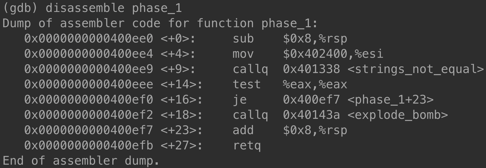
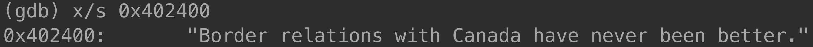
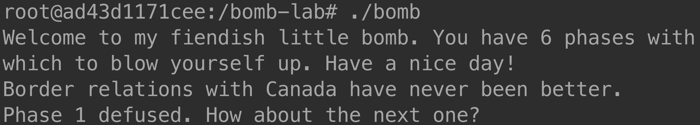

# Solution for Bomb Lab

In this solution, I would use `gdb` to debug the bomb. Refer to below for the commands I used. 

- `gdb bomb` -  Start `gdb` and load the executable file `bomb`.
- `b func` - add a breakpoint at function `func`.
- `i b` - list all breakpoints
- `disassemble func` - disassemble function `func`
- `x/s addr` - examine the memory at address `addr` as a string

## 🏁 To Begin With...

Always keep in mind to add a breakpoint at `explode_bomb` function. `explode_bomb` function is what causes the bomb to explode! This breakpoint will prevent from mistakenly exploding the bomb. 

Also, review `bomb.c` as an overview of the bomb. This will help you to understand the bomb executable. Then, you can notice that the pattern below is repeatedly appers in the source code. 

```c++
input = read_line();
phase_k(input);
phase_defused();
```

As can be seen in the code snippet, it starts with getting an input string from the user or a given file. Then call `phase_n` function with the input string. This will do nothing if `input` is a correct code. Otherwise, the bomb would explode by calling `explode_bomb` function. If the bomb did not explode, then this phase is defused by calling `phase_defused` function. 

So, what we can learn from this code snippet is: all we need to look into is the `phase_n` function. We will hopefully find the code (i.e., password) of the bomb of each phase in the `phase_n` function. 

Let's get started! Execute `gdb bomb` in the command line to run `gdb` and load the bomb executable. 

## 🥱 Phase 1

As mentioned earlier, we need to look into the `phase_1` function. To do this, call `disassemble phase_1`. 



Where we need to focus on is the second line of the assembly code: `mov $0x402400, %esi`. This command moves (i.e., stores) the intermediate value 0x402400 into the register `%esi`. Recall that the purpose of the `%esi` register is used to store the argument for a function call. So, we can assume that 0x402400 is the memory address of the password string. Let's find the content string at this address using `x/s`. 



Whoa! We found the password of phase 1! It is `Border relations with Canada have never been better.`. So, if we input this string, the bomb will be defused in phase 1. 



## 🙂 Phase 2

## 😶 Phase 3

## 😭 Phase 4

## 😡 Phase 5

## 😈 Phase 6
