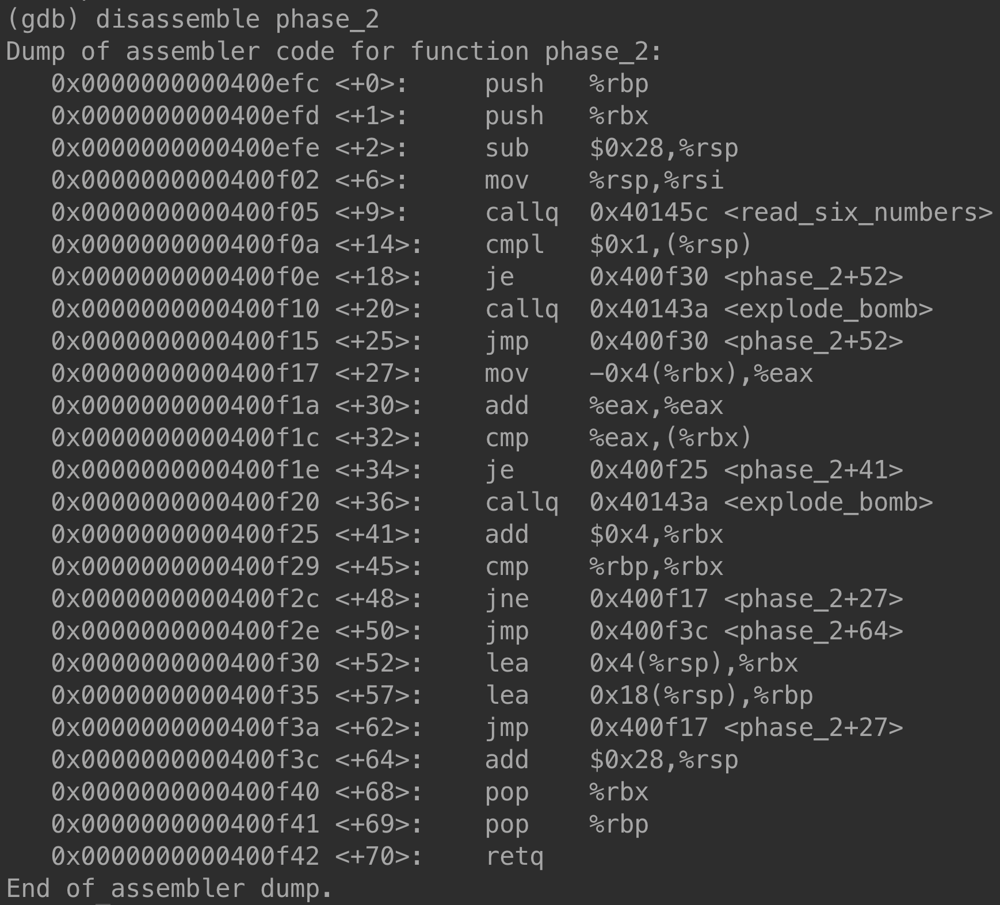

# Solution for Bomb Lab

In this solution, I would use `gdb` to debug the bomb. Refer to below for the commands I used. 

- `gdb bomb` -  Start `gdb` and load the executable file `bomb`.
- `b func` - add a breakpoint at function `func`.
- `i b` - list all breakpoints
- `disassemble func` - disassemble function `func`
- `x/s addr` - examine the memory at address `addr` as a string

## 🏁 To Begin With...

Always keep in mind to add a breakpoint at `explode_bomb` function. `explode_bomb` function is what causes the bomb to explode! This breakpoint will prevent from mistakenly exploding the bomb. 

Also, review `bomb.c` as an overview of the bomb. This will help you to understand the bomb executable. Then, you can notice that the pattern below is repeatedly appers in the source code. 

```c++
input = read_line();
phase_k(input);
phase_defused();
```

As can be seen in the code snippet, it starts with getting an input string from the user or a given file. Then call `phase_n` function with the input string. This will do nothing if `input` is a correct code. Otherwise, the bomb would explode by calling `explode_bomb` function. If the bomb did not explode, then this phase is defused by calling `phase_defused` function. 

So, what we can learn from this code snippet is: all we need to look into is the `phase_n` function. We will hopefully find the code (i.e., password) of the bomb of each phase in the `phase_n` function. 

Let's get started! Execute `gdb bomb` in the command line to run `gdb` and load the bomb executable. 

## 🥱 Phase 1

As mentioned earlier, we need to look into the `phase_1` function. To do this, call `disassemble phase_1`. 


Where we need to focus on is the second line of the assembly code: `mov $0x402400, %esi`. This command moves (i.e., stores) the intermediate value 0x402400 into the register `%esi`. Recall that the purpose of the `%esi` register is used to store the argument for a function call. So, we can assume that 0x402400 is the memory address of the password string. Let's find the content string at this address using `x/s`. 


Whoa! We found the password of phase 1! It is `Border relations with Canada have never been better.`. So, if we input this string, the bomb will be defused in phase 1. 


## 🙂 Phase 2



This can be seen as a use of a for loop. Let's take a look at the assembly. First two lines are for initializing the function. `%rbp` is used to keep track of the base of the current stack frame. To get back to where the function `phase_2` is called after a `return` statement, this stack frame should be stored. 

Also, `%rbx` is one of callee-saved registers, which should be restored before/after a function call. So, this assembly code stores the value `%rbp` and `%rbx` into the stack and restores them at the end of the function. 

`sub $0x28, %rsp` is for allocating 0x28 bytes of memory for local variables. `%rsp` register is used as a stack pointer. This function declares an integer array of 6 length and an index variable, so it requires 28 bytes. You will see this in the very soon. 

For simplicity, I would assume that `%rsp` is 0. Then, we can consider the memory address starts from 0. `mov %rsp, %rsi` moves the value of `%rsp` into `%rsi`. Considering `%rsi` is the second argument of a function call, this is exactly the same as passing the first address of an array to a function. In this case, `%rsp` is the first address of the array of 6 integers. Then, `read_six_numbers` function is called. Note that `%rdi` has not changed, so it will still be used as the first argument of `read_six_numbers` function call. 

After calling `read_six_numbers`, there are 6 integers in the array. Denoting the memory as an array `M`, `M[0]` is the first integer, `M[4]` is the second integer, and so on. Integer takes 4 bytes. The next lines `cmpl $0x1, (%rsp)` and `je <phase_2+52>` is equivalent to `if (M[0] == 1) jump_to(phase_2+52);`. That is, if the first integer is 1, then jump to the address `phase_2+52`. Whoa! The first integer happens to be 1. 

Then, `lea 0x4(%rsp), %rbx` performs `%rbx = %rsp + 4`. We have assumed `%rsp` to be 0, `%rbx = 4`. You will find out something if I replace `%rbx` with an index variable `i`. This initializes `i = 4`. Similarly, `lea 0x18(%rsp), %rbp` is interpreted as `%rbp = 24`. Let's move on to `<phase_2+27>` following the `jmp` instruction. 

Replacing `%eax` with a variable `cur`, `mov -0x4(%rbx), %eax` is interpreted as `cur = M[i - 4]`. `add %eax, %eax` is equivalent to `cur += cur`. `cmp %eax, (%rbx)` and `je <phase_2+41>` are merged into `if (cur == M[i]) jump_to(phase_2+41)`. Initially, `i = 4`, so `cur = 2`. The second integer is found to be 2. 

Move on to `<phase_2+41>`, where `add $0x4, %rbx` increments `i` by 4, `cmp %rbp, %rbx` performs `if (i == 24)`, and `jne <phase_2+27>` is equivalent to `jump_to(phase_2+27)`. This is a for loop! Until `i` reaches 24, the loop continues. To understand this, let's convert this assembly code into C code using a for loop. 

```c++
void phase_2(char *input) {
    int arr[6], i;
    read_six_numbers(input, arr);
    if (arr[0] != 1) explode_bomb();
    for (int i = 1; i != 6; i++)
        if (arr[i - 1] * 2 != arr[i]) explode_bomb();
}
```

As mentioned, 28 bytes of stack memory has been allocated for local variables `arr` and `i`. Note that integer literals storing the memory address are scaled down by 4. This is because integer takes 4 bytes. For example, 24 is 6 and 4 is 1 in the C code. 

Therefore, the password of phase 2 is 1 2 4 8 16 32. 

## 😶 Phase 3

## 😭 Phase 4

## 😡 Phase 5

## 😈 Phase 6
